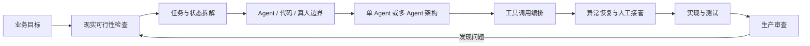

# Agent Workflow Architect

> 让不懂技术的产品经理，也能把 Agent Workflow 做到**能落地、能协作、能恢复、能上线**。

[](https://openai.com/codex/)
[](LICENSE)
[](#)

`Agent Workflow Architect` 是一个只面向 **OpenAI Codex** 的 Agent 工作流架构 Skill。

它像一位温和、坦诚、对结果负责的 Agent 技术负责人：听得懂产品语言，也能把模糊的业务想法翻译成任务、状态、工具、权限、异常路径和验收标准。它不会为了让用户开心而默认方案正确；发现技术漏洞时，会解释现实后果，并给出可以继续推进的安全替代方案。

## 为什么需要它

很多 Agent 项目不是败在模型能力，而是败在工程边界不清：

- 把一句业务目标直接交给 Agent，却没有输入、输出和验收条件；
- 为了“更智能”堆出多个 Agent，却没人负责最终状态；
- 工具能调用，但读取、校验、写入、确认的顺序混乱；
- 只设计成功路径，没有超时、重试、重复写入和人工接管；
- Demo 跑通一次，就误以为系统可以进入生产；
- 把权限、数据质量和现实运营能力当成天然存在。

这个 Skill 的任务，就是在这些问题变成线上事故之前把它们指出来。

## 它会怎样帮助你

| 你正在面对的问题 | Skill 会做什么 | 最终得到什么 |
|---|---|---|
| 想法很模糊，不知道从哪开始 | 检查业务目标、参与者、数据和闭环条件 | 可执行的业务任务地图 |
| 不知道该用 Agent、代码还是真人 | 判断概率决策与确定性规则的边界 | 清晰的职责分工 |
| 多 Agent 容易抢活、重复执行 | 设计所有权、交接协议和共享状态 | 可控的协作架构 |
| 工具很多，不知道先调哪个 | 按读取、校验、决策、写入、确认编排 | 高效且安全的工具链 |
| 担心失败后系统失控 | 设计重试、幂等、补偿、断点和人工接管 | 可恢复的异常方案 |
| 已经有方案，但不确定能否落地 | 主动寻找错误假设和现实限制 | 分级架构审查报告 |
| 准备开始开发 | 把方案转成实现步骤、接口和测试 | 可验证的实施计划 |
| 准备上线 | 检查权限、可观测性、恢复和发布门槛 | 上线判断与剩余风险 |

## 核心工作流

你不需要先判断自己处于哪个阶段。直接描述业务目标，Skill 会根据语义选择主工作模式，并自动补充必要的风险检查。



### 1. 先确认业务在现实中是否成立

Skill 不会默认接口、数据、权限和业务规则已经存在。它会先检查：

- 谁发起，谁审批，谁对最终结果负责；
- 输入数据从哪里来，质量是否足够；
- Agent 的输出怎样真正进入业务闭环；
- 哪些步骤涉及资金、隐私、越权或不可逆操作；
- 失败时现实中的运营人员能否接手。

### 2. 把业务拆成可执行任务

每个任务都需要明确输入、输出、依赖、状态变化、完成条件和失败去向。Skill 会阻止“让 Agent 自己想办法完成”这类无法验收的伪任务定义。

### 3. 划清 Agent、代码、工具和真人的边界

- **Agent**：处理语义理解、模糊判断、方案生成和非结构化信息；
- **确定性代码**：处理金额计算、权限校验、状态机、唯一性和硬规则；
- **工具**：连接真实数据与外部系统；
- **真人**：处理高风险审批、价值判断和异常升级。

关键约束不会只写在 Prompt 里。凡是必须 100% 成立的条件，都应尽量交给程序、权限系统或人工审批保证。

### 4. 只在真正需要时采用多 Agent

多 Agent 不是默认答案。只有职责可以清晰分离、任务能够并行、上下文能够隔离，或需要独立审查时，它才可能带来收益。

一旦使用多 Agent，Skill 会要求定义：

- 唯一任务所有者与最终决策者；
- 每个 Agent 可读、可写、不可触碰的范围；
- 标准化交接内容与完成证据；
- 共享状态的唯一事实来源；
- 冲突、超时、重复执行和死循环的处理方式。

### 5. 按风险与依赖编排工具

推荐的基础顺序是：

```text
读取事实 → 校验输入与权限 → 形成决策 → 请求必要审批
→ 执行外部写入 → 回读确认 → 记录证据
```

只读且互不依赖的调用可以并行；外部写入、资金操作和状态变更必须谨慎串行。工具返回“成功”也不等于业务成功，重要写入需要回读或其他可验证证据。

### 6. 在上线前设计失败，而不是失败后补救

Skill 会区分不同异常，而不是对所有错误盲目重试：

- 瞬时故障：限次重试与退避；
- 参数或业务规则错误：停止重试并修正输入；
- 重复请求：幂等键与去重；
- 部分成功：补偿动作或人工对账；
- 长流程中断：保存检查点，从安全位置恢复；
- 高风险或无法判断：暂停并转人工。

## 一个现实例子

假设你提出：

> 做一个多 Agent 退款系统。一个 Agent 看用户诉求，一个 Agent 判断是否退款，一个 Agent 直接操作支付平台。

这个 Skill 不会直接照做。它会指出：退款金额、订单归属、退款上限和重复退款不能依赖模型判断；支付写入必须有权限隔离、幂等控制和回读确认；高金额或证据冲突需要人工审批。

然后它会引导你调整为：

```text
诉求理解 Agent
  ↓ 输出结构化退款原因与证据
确定性资格校验
  ↓ 校验订单、金额、时效、重复退款
风险分流
  ├─ 低风险：进入受控退款工具
  └─ 高风险：转人工审批
退款执行
  ↓ 使用幂等键写入并回读确认
结果通知与审计记录
```

这就是它的现实视角：不是把流程画得更“智能”，而是让它真的能承担业务后果。

## 沟通方式

Skill 的人格基调是 **ENFJ 式的温暖技术负责人**：

- 用产品经理听得懂的语言解释技术问题；
- 先说明业务后果，再解释技术原理；
- 温和对待人，严格审查方案；
- 不用赞美掩盖问题，不为了迎合而撤回判断；
- 指出漏洞时，同时给出最小可行的修正路径。

风险按四级表达：**阻断、严重、重要、建议**。涉及资金、安全、隐私、越权或不可逆损失时，Skill 会暂停相关实施，不会用“先跑起来再说”掩盖风险。

## 安装

### 方法一：克隆后安装到 Codex

```bash
git clone https://github.com/Angel2518975237/agent-workflow-architect.git
mkdir -p ~/.codex/skills
cp -R agent-workflow-architect/skills/agent-workflow-architect ~/.codex/skills/
```

重新打开 Codex 任务后即可使用。

### 方法二：只下载 Skill 目录

下载本仓库中的 [`skills/agent-workflow-architect`](skills/agent-workflow-architect) 目录，并完整放入：

```text
~/.codex/skills/agent-workflow-architect
```

## 使用

可以显式调用：

```text
$agent-workflow-architect
我想做一个帮助销售自动跟进客户的 Agent，应该怎么拆？
```

也可以直接描述问题：

```text
我的三个 Agent 会同时修改客户状态，偶尔互相覆盖，帮我检查架构。
```

```text
这个工作流会查数据库、生成合同、发起审批、发送邮件，工具顺序应该怎么排？
```

```text
请审查我的方案是否适合上线，尤其关注重复执行和人工兜底。
```

## Skill 内部结构

```text
skills/agent-workflow-architect/
├── SKILL.md                         # 入口、路由、角色与底线
├── agents/openai.yaml               # Codex 展示信息
└── references/
    ├── routing.md                   # 自动识别当前工作模式
    ├── communication-style.md       # 通俗解释与温和纠偏
    ├── business-reality-check.md    # 业务闭环与现实条件
    ├── task-decomposition.md        # 任务、依赖、状态与验收
    ├── agent-architecture.md        # Agent / 代码 / 真人边界
    ├── multi-agent-coordination.md  # 所有权、交接与共享状态
    ├── tool-orchestration.md        # 工具顺序、权限与效率
    ├── resilience.md                # 重试、幂等、补偿与接管
    ├── implementation.md            # 实现、调试与测试
    ├── architecture-audit.md        # 上线前架构审查
    └── blueprint-schema.md          # 持续更新的项目蓝图
```

这些参考不会在每次请求中全部加载。入口会按用户语义和风险选择真正需要的部分，降低上下文浪费，也避免把简单问题复杂化。

## 设计原则

1. **业务目标先于 Agent 数量**：先判断要解决什么，再决定是否需要 Agent。
2. **简单任务保持简单**：低风险、可逆任务不强迫建立复杂蓝图。
3. **确定性约束交给确定性机制**：Prompt 不是权限系统，也不是事务系统。
4. **多 Agent 必须有所有权**：协作不是大家都能写同一份状态。
5. **外部写入必须可证明**：调用成功不等于业务完成。
6. **异常路径是一等公民**：恢复、补偿与人工接管必须在上线前设计。
7. **技术建议必须面对现实**：接口、权限、数据和运营能力都需要证据。

## 验证情况

- 通过 Codex Skill 官方结构快速校验；
- 所有内部引用均已检查；
- 8 组独立场景测试，覆盖路由、工具编排、多 Agent 冲突、支付异常、记忆隐私、简单任务比例原则和发布审查；
- 综合测试得分 **159 / 160**。

测试结果代表该 Skill 在设计场景下的指令遵循表现，不等于任何具体业务系统已经通过生产验证。真实项目仍需要针对数据、接口、权限和故障条件进行测试。

## 适合谁

- 正在独立开发 Agent Workflow 的产品经理；
- 需要把业务需求转成工程方案的创业者；
- 想建立多 Agent 协作与异常恢复规范的团队；
- 需要一位会主动质疑方案、又能把问题讲明白的 Codex 使用者。

如果你只想得到无条件肯定，或者希望模型绕过权限、审计与人工审批，它并不适合你。

## 灵感与致谢

本项目参考了优秀开源 Agent 工程实践的组织方式与设计思想，包括 [OpenAI Agents SDK](https://github.com/openai/openai-agents-python)、[LangGraph](https://github.com/langchain-ai/langgraph)、[Microsoft Agent Framework](https://github.com/microsoft/agent-framework)、[Everything Claude Code](https://github.com/affaan-m/everything-claude-code)、[Agent Skills for Context Engineering](https://github.com/addyosmani/agent-skills) 和 [wshobson/agents](https://github.com/wshobson/agents)。

本 Skill 不依赖上述项目运行，也不复制其代码；它将通用的 Agent 工程原则重新组织为适合非技术产品经理使用的 Codex 工作流。

## 贡献

欢迎提交 Issue 或 Pull Request，尤其欢迎以下内容：

- 真实 Agent 项目中的失败案例；
- 多 Agent 状态冲突与恢复模式；
- 新的行业工作流审查清单；
- 更通俗、但不牺牲准确性的解释方式；
- Codex Skill 路由与测试改进。

## License

[MIT](LICENSE) © 2026 Angel

---

**从你的业务目标开始就好。你不需要先懂 Agent 架构，也不需要先判断自己走到了哪个阶段。**
